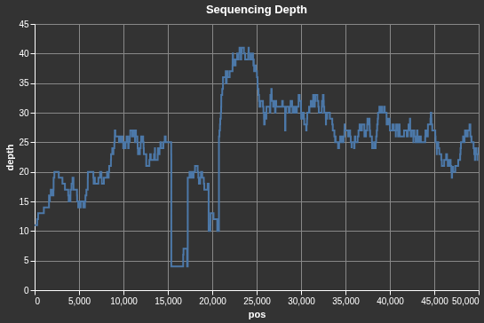
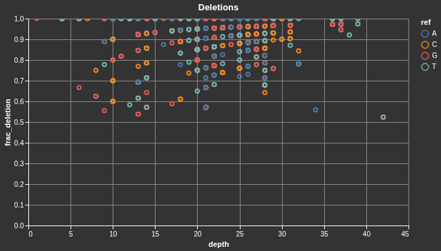

# bam_rs
BAM cli toolkit for pileup analysis of single end read alignments such as Oxford Nanopore or PacBio.

## Requirements
- Linux OS (Ubuntu 24.04.2)
- Rust >= 1.90.0

## Install
The easiest way to get started is to download a precompiled Linux binary from the latest [release](https://github.com/OscarAspelin95/bam_rs/releases).

## Install from source
Clone the repository or download the source code. Enter the bam_rs directory and run: 

`cargo build --release`

The generated binary is available in `target/release/bam_rs`.

## Usage
Run with: 
`bam_rs --bam <reads.bam> --fasta <ref.fa> --outfile <output.tsv>`

Required arguments:
<pre>
<b>-b/--bam</b>     - Path to BAM file (.bam).
<b>-f/--fasta</b>   - Path to FASTA reference file (.fa, .fasta, or .fna). A FASTA index (.fai) will be created automatically if one does not exist.
<b>-o/--outfile</b> - Output file path for the pileup result (.tsv).
</pre>

Optional arguments:
<pre>
<b>-c/--context</b>                  [0]    - Number of reference bases to include on each side of each position in the `ref` column. Useful for identifying homopolymer regions around high-indel positions in Oxford Nanopore data. Positions near contig boundaries are clamped to the available sequence.
<b>--min-alternate-frac-canonical</b> [off]  - Only emit positions where frac_aln_canonical is less than or equal to this value. E.g. 0.5 retains only positions where fewer than half of canonical base calls match the reference, highlighting heterogeneous or variant sites.
</pre>

For example, `--context 5` will expand the `ref` column from a single base (`A`) to an 11-character window (`TTTTTATTTTG`).

## Output
The output is a tab-separated file with one row per covered position:

| Column | Description |
|--------|-------------|
| `contig` | Contig/chromosome name |
| `pos` | 0-based position |
| `depth` | Total read depth at position |
| `ref` | Reference base at this position, with up to `--context` flanking bases on each side |
| `A` | Count of A bases |
| `C` | Count of C bases |
| `G` | Count of G bases |
| `T` | Count of T bases |
| `N` | Count of N bases |
| `del` | Count of deletions |
| `frac_aln_canonical` | Fraction of canonical bases matching reference (ref_count / A+C+G+T) |
| `frac_aln_absolute` | Fraction of all reads matching reference (ref_count / depth) |
| `frac_deletion` | Fraction of reads with a deletion (del_count / depth) |
| `base_phred` | Mean Phred quality score across all reads at this position |

## Development
Common development tasks are available via the `Makefile`

## Visualizing
The `notebook` directory contains a marimo notebook for interactively visualizing the output file (see a few examples below). Note that this requires the [uv](https://github.com/astral-sh/uv) package manager (see `notebook/README.md` for details).

</img>
</img>

